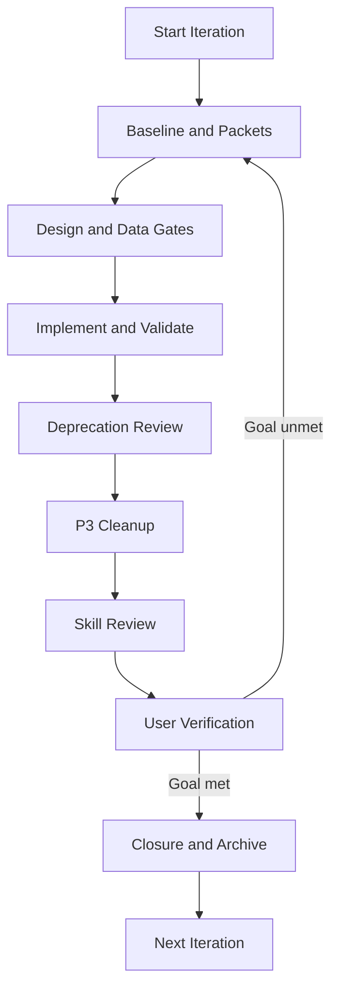
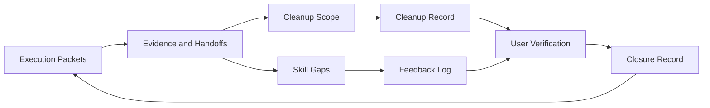
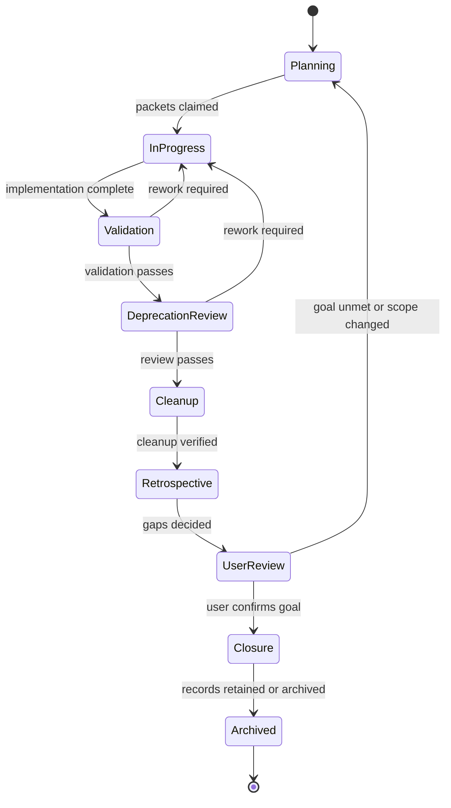

## Revision history

- 2.0.0 (2026-08-30): Added an explicit deprecation-review lifecycle state
  between validation and cleanup.
- 1.1.0 (2026-08-30): Added deprecation review, exception expiry checks,
  tracker reconciliation, and practice experiments to iteration closure.

# Project Lifecycle

This skill coordinates the other three skills. It does not implement packets.

## Iteration loop



## Phase-to-skill mapping

| Phase                                                                                           | Primary skill                  | Responsibility                                                               |
| ----------------------------------------------------------------------------------------------- | ------------------------------ | ---------------------------------------------------------------------------- |
| Baseline, P0 Foundations, Data Gate, P1 Implementation, P2 Design Gaps, Final Integration Audit | `phased-engineering-execution` | Packets, ownership, locks, gates, evidence, validation, handoffs             |
| P1 Implementation (coding)                                                                      | `coding-principles`            | DRY, SOLID, KISS, YAGNI, composition, boundaries, and architecture alignment |
| P3 Cleanup                                                                                      | `cleanup-protocol`             | Dead code, stale artifacts, dependency pruning, retention, tracker archival  |
| Task Closure retrospective                                                                      | `skill-evolution`              | Skill gaps, user decisions, versioned updates, feedback tracking             |
| Orchestration, user verification, closure                                                       | `project-lifecycle`            | Iteration boundaries, sequencing, closure record, next iteration             |

## Iteration boundaries

An iteration may contain one feature, a focused refactor, or a bounded group of related packets.

### Entry criteria

- The prior iteration is closed or explicitly paused.
- `execution-tracker.md` exists and has no untransferred active locks.
- The objective, scope, owner, and expected closure conditions are recorded.
- Applicable Skill versions are pinned.

### Exit criteria

- Every packet is `Complete` or has a documented user-approved disposition.
- Required validation and evidence are complete.
- Deprecations, sunset candidates, and exceptions have been reviewed.
- No expired exception or overdue removal is silently carried forward.
- Cleanup has run and high-risk actions have user approval.
- All skill gaps have a user decision.
- The closure record is complete and user verification is recorded.
- Active trackers are archived or intentionally retained under policy.

## Cross-skill data flow



## Lifecycle states



## Closure checklist

```yaml
closure_id: PROJECT-T001-CLS001
task_id: PROJECT-T001
timestamp: ""
goal_achievement:
  original_objective: ""
  outcome_summary: ""
  criteria_met: []
  criteria_missed: []
  evidence_refs: []
cleanup_verification:
  dead_code_removed: []
  stale_artifacts_archived: []
  temp_files_deleted: []
  trackers_archived: []
  orphaned_packets_resolved: []
  high_risk_approvals: []
skill_review:
  # Capture gaps from every applicable skill, including coding-principles.
  gaps_discovered: []
  gaps_actioned: []
  gaps_deferred: []
  gaps_rejected: []
  skill_updates: []
bloat_audit:
  duplicate_packets: []
  duplicate_evidence: []
  stale_trackers: []
  unresolved_items: []
user_confirmation:
  goal_achieved: false
  cleanup_approved: false
  skill_reviewed: false
  ready_to_archive: false
  confirmed_by: ""
  confirmed_at: ""
next_actions: []
deprecation_review:
  overdue: []
  expired_exceptions: []
  removal_decisions: []
  retained_items: []
practice_experiments:
  proposed: []
  approved: []
  measured: []
  retained: []
  revised: []
  rejected: []
```

## When to start a new iteration

- The current goal is achieved and closed.
- The user requests new work.
- A discovered requirement exceeds the current scope.
- A major blocker requires a fresh baseline or new design.
- A rejected handoff changes the objective or packet boundaries.

Do not silently expand a closed or active iteration.

## Safeguards

- Never start a new iteration while the prior iteration has unclosed packets or active locks.
- Never skip a gate, validation, cleanup, skill review, or user confirmation.
- Never archive active work or delete evidence before retention rules permit it.
- Never accept a handoff without receiver status and reasons.
- Never leave unresolved high-severity skill gaps hidden in chat.
- Never remove deprecated behavior solely because its code appears unused.
- Never carry an exception beyond its expiry without a new user-approved
  decision.
- At every phase boundary, reconcile tracker states, locks, handoffs, and
  closure records.
- Never let active packet, evidence, or feedback directories accumulate duplicates.

## Cross-skill references

- `phased-engineering-execution/SKILL.md`
- `cleanup-protocol/SKILL.md`
- `skill-evolution/SKILL.md`
